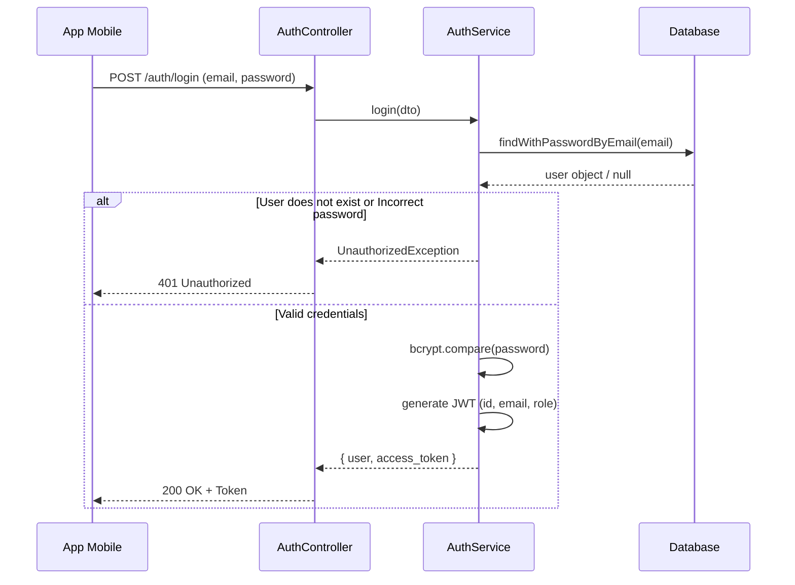

# Authentication Flow Analysis

This document details the authentication flow implemented in the backend of the **Food Waste Reduction** project. It is based on JSON Web Tokens (JWT) and user roles to maintain the security of the mobile application and differentiate between clients and commerces.

## 1. Registration Flow (Clients and Commerces)

When a new user or commerce joins the platform, the flow is as follows:

1. **Client to Backend:** The client sends their data (`POST /auth/register` or `POST /auth/register-commerce`). The class validations (`class-validator`) ensure that data such as email, password, or nit are correct.
2. **Service Layer (AuthService & UsersService):**
   - The system verifies that the email does not already exist in the database to prevent duplicates (`ConflictException`).
   - The password is encrypted using `bcrypt` before persisting it.
   - The User record and its `Profile` are created. If it is a commerce, a record is also linked in the `Commerce` table.
3. **JWT Generation:** A JWT token is signed containing the user ID, email, and their **ROLE** (`CLIENT` or `MERCHANT`).
4. **Response:** The token and user data are returned so the mobile application can automatically log in after registration.

## 2. Login Flow

## 3. Active Session Verification (Endpoint /auth/me)

Since the mobile application saves the token, when opening it again it is not necessary to ask for the user and password.

1. **Opening the App:** The app reads the locally saved token.
2. **Request to Backend:** A `GET /auth/me` request is made sending the token in the header (`Authorization: Bearer <token>`).
3. **JWT Validation:** The `JwtAuthGuard` and the `JwtStrategy` intercept the request. If the token expired or was tampered with, a `401 Unauthorized` is returned and the app must go to the login screen.
4. **Successful Response:** If the token is valid, the full user information including their ROLE is returned. 
5. **Redirection:** The app reads the `role` and automatically navigates to `ClientHomeScreen` (for clients) or the Restaurant Dashboard (for commerces).

## 4. Logout

The endpoint `POST /auth/logout` allows closing the session. Since we use JWT (stateless tokens saved on the client), the backend's main job is to confirm the closure, but it is the absolute responsibility of the **Mobile App** to delete the token from local storage (for example, using `flutter_secure_storage`).

---
**Security Conclusion:**
- All passwords are salted and encrypted (bcrypt).
- Sensitive endpoints and operations are protected behind the `JwtAuthGuard` wall.
- The separation of roles (`UserRole.CLIENT` and `UserRole.MERCHANT`) allows scaling and restricting permissions in the future (e.g. using a `RolesGuard`).
